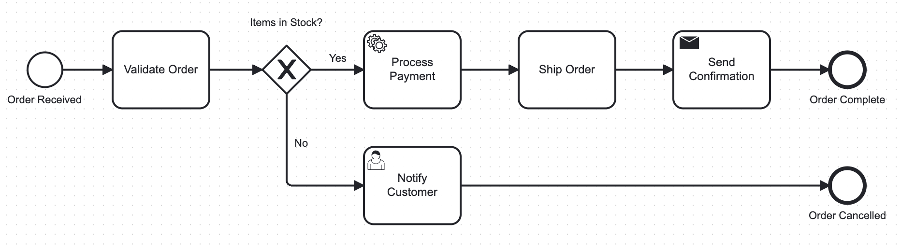
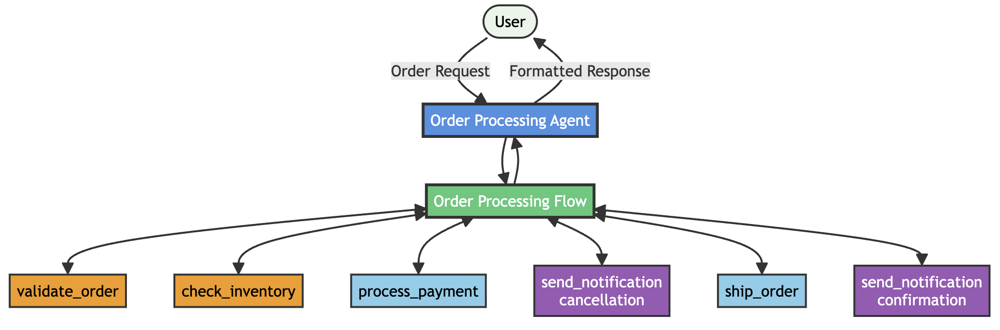

# Bob 스킬과 watsonx Orchestrate를 사용하여 BPMN 다이어그램을 프로덕션 준비 에이전트로 전환

**사전 요구사항:** Bob 및 watsonx Orchestrate에 대한 기본 이해

> **출처**: 이 튜토리얼은 IBM Developer의 공식 튜토리얼을 기반으로 작성되었습니다.  
> 원문: https://developer.ibm.com/tutorials/bpmn-to-agents-bob-skills-watsonx-orchestrate/

## 개요

비즈니스 프로세스 다이어그램을 실제 작동하는 소프트웨어로 전환하는 작업은 일반적으로 시간, 전문 기술, 그리고 팀 간의 많은 인수인계가 필요합니다. 비즈니스 분석가는 BPMN(Business Process Model and Notation)과 같은 모델로 워크플로우를 정의합니다. 그런 다음 개발자는 이러한 모델을 코드로 변환하고, 로직을 검증하며, 의도와 구현 간의 격차를 수정하는 데 몇 주를 소비합니다.

### BPMN이란?

**BPMN(Business Process Modeling Notation)은 비즈니스 프로세스를 누구나 이해하기 쉽게 시각적으로 표현하는 글로벌 표준 그래픽 표기법입니다.**

이 튜토리얼은 더 빠르고 신뢰할 수 있는 방법을 보여줍니다. IBM Bob 스킬을 사용하여 BPMN 비즈니스 프로세스를 완전히 작동하는 watsonx Orchestrate 에이전트로 변환합니다. Bob은 프로세스 모델을 분석하고, 명확한 표준 운영 절차(SOP)를 생성하며, 해당 사양을 사용하여 에이전트, 워크플로우, 도구, 테스트 및 배포 스크립트를 구축합니다.

이 튜토리얼을 완료하면 비즈니스 사양이 실행 가능한 자동화로 직접 전환되는 방법을 확인할 수 있습니다. 또한 Bob 스킬과 watsonx Orchestrate MCP 서버가 수동 작업을 줄이고, 모범 사례를 적용하며, 개발자가 처음부터 시작하는 대신 검토 및 사용자 정의에 집중할 수 있도록 돕는 방법을 확인할 수 있습니다.


---

## 자동화된 주문 처리 솔루션의 아키텍처

자동화된 주문 처리 솔루션은 지능형 에이전트를 사용하여 전체 주문 라이프사이클을 관리합니다. 에이전트는 주문 검증, 재고 확인, 결제 처리, 주문 배송 및 고객 알림을 수행합니다. 비즈니스 프로세스는 BPMN 표기법을 사용하여 정의되며, 주문이 완료되거나 취소되는지를 결정하는 명확한 재고 의사 결정을 포함합니다.

사용자가 에이전트에 주문 요청을 제출합니다. 에이전트는 주문 세부 정보를 검증하고 재고 가용성을 확인합니다. 품목이 재고에 있으면 에이전트는 결제를 처리하고, 배송을 생성하며, 확인 메시지를 보냅니다. 품목을 사용할 수 없는 경우 에이전트는 취소 알림을 보냅니다. 

이 튜토리얼은 사양 기반 개발(spec-driven development) 접근 방식을 따르며, Bob 스킬이 비즈니스 사양을 실행 가능한 자동화로 변환합니다.

### 주문 처리 흐름

```
[주문 요청] 
    ↓
[주문 검증]
    ↓
[재고 확인]
    ↓
[재고 있음?] ─── 예 ──→ [결제 처리] → [배송 생성] → [확인 알림]
    │
    아니오
    ↓
[취소 알림]


```


Bob은 BPMN 모델을 분석하고 비즈니스 프로세스를 작동하는 watsonx Orchestrate 솔루션으로 변환합니다.





## Bob이 생성하는 구성 요소

Bob은 다음과 같은 구성 요소를 생성합니다:

### 1. 주문 처리 에이전트 (Order Processing Agent)
고객 주문을 수신하고 주문 검증부터 주문 이행까지 전체 워크플로우를 관리합니다.

### 2. 주문 처리 플로우 (Order Processing Flow)
BPMN 비즈니스 로직을 구현합니다. 플로우에는 재고 가용성에 따른 조건부 분기가 포함됩니다.

### 3. 모의 통합이 포함된 Python 도구
다음과 같은 모의 통합 로직이 포함된 Python 도구를 생성합니다:

- **validate_order**: 주문 완전성을 검증합니다. 검증에는 고객 정보, 주문 품목, 배송 주소 및 결제 방법이 포함됩니다.
- **check_inventory**: 모든 주문 품목의 재고 가용성을 확인합니다.
- **process_payment**: 고객 결제를 처리하고 거래 ID를 생성합니다.
- **ship_order**: 배송을 생성하고, 운송업체를 할당하며, 추적 번호를 생성합니다.
- **send_notification**: 주문 확인 및 주문 취소에 대한 고객 알림을 전송합니다.

이러한 구성 요소들이 함께 BPMN 주문 프로세스를 실행 가능한 에이전트 워크플로우로 구현하는 완전한 watsonx Orchestrate 아키텍처를 형성합니다.
