# 🔬 실습: Bob을 사용하여 AI 에이전트를 프로덕션에 배포하기

> **📌 원본 출처**: [IBM Agentic AI Client Bootcamp - Bob & Orchestrate Lab](https://github.ibm.com/skol/agentic-ai-client-bootcamp/blob/main/usecases/add-ons/bob-orchestrate/bob-lab-instructions.md)

이 실습에서는 AI 소프트웨어 개발 파트너인 Bob이 여러분의 웹사이트에 AI 에이전트를 임베드하는 것을 도와줍니다.

## 사전 요구사항

- 로컬에 IBM Bob IDE가 설치되어 있어야 합니다.
- Competitive Analysis 실습을 완료해야 합니다.
- 해당 프로젝트에 사용한 IBM API 키를 준비해야 합니다.
- **[abc-robots-website-final_v2.zip](asset/abc-robots-website-final_v2.zip)** 파일을 다운로드하고 압축을 해제해야 합니다. 이 폴더에는 Orchestrate 에이전트를 임베드할 웹사이트가 포함되어 있습니다.
- 강사가 제공한 모든 필요한 자격 증명이 있어야 합니다.

## 중요 참고사항

생성형 AI는 비결정적이므로, 얻는 결과가 지침에 제공된 스크린샷과 다를 수 있습니다. 이는 예상되고 정상적인 현상입니다. 문제가 발생하면 강사에게 문의하거나 Bob에게 도움을 요청하세요.

## 실습 지침

이제 ABC Robots의 내부 웹사이트에 비교 에이전트를 별도로 배포하여 ABC Robots 직원들이 자사 로봇 청소기 라인업에 대한 경쟁 분석을 수행할 수 있도록 합니다.

1. 강사가 제공한 ABC Robots 웹사이트 ZIP 파일의 압축을 해제합니다.
2. IBM Bob IDE를 열고, Bob에서 ABC Robots 웹사이트 폴더를 엽니다.

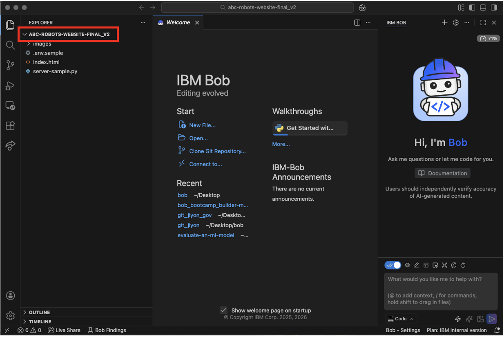

3. 폴더에 제공된 `.env.sample` 파일과 유사하게 `.env` 파일을 생성합니다.

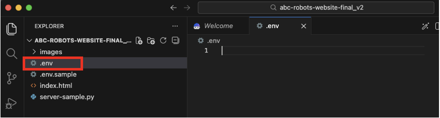

4. watsonx Orchestrate 인스턴스에서 **Manage Agents**로 이동한 다음 Competitive Analysis Lab의 **Master Agent**로 이동합니다.
-> Master Agent <본인이름>

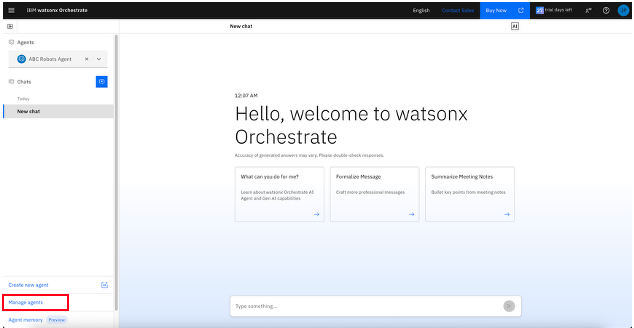

5. 아래로 스크롤하여 **Channels**를 찾고 **Embedded Agent**를 클릭합니다.

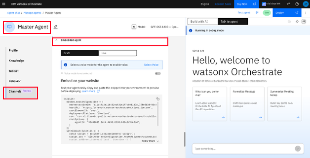

6. 여기 코드 블록에서 에이전트 ID를 복사하여 생성한 `.env` 파일의 Agent ID에 붙여넣습니다. 강사가 Instance ID와 API Key를 제공할 것입니다. 이를 `.env` 파일에 추가합니다.

instance url:

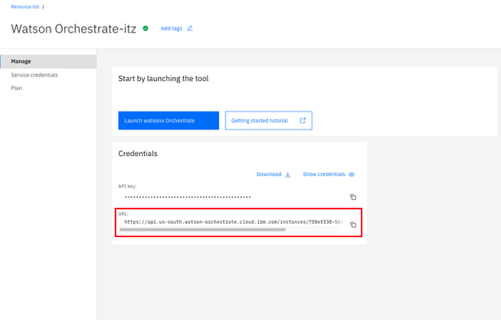

7. Bob 채팅에서 다음 프롬프트를 복사하여 붙여넣습니다:

```
I have a website 'index.html' (see below for file content) that showcases products several products.
I want to add a new page called "Competitive Analysis" that's linked from the home screen. It should follow the same look and feel as the rest of the website.
On this page, I need two drop-down to select products to compare, and a "Compare" button. When clicked, it should send the selections to an AI agent that will return a comparison between the two products. Display the results on the page, it should be able to read the markdown format.
Use this as a starting point and to understand how to connect an agent to the website: @server-sample.py. Create the requirements.txt file with the necessary dependencies without version numbers and execute the commands needed to build the virtual environment.
Finally, create a README.md file with instructions on how to run the application locally.
```

**한국어 프롬프트:**

```
여러 제품을 소개하는 'index.html' 웹사이트가 있습니다(아래 파일 내용 참조).
홈 화면에서 링크되는 "Competitive Analysis"라는 새 페이지를 추가하고 싶습니다. 이 페이지는 웹사이트의 나머지 부분과 동일한 디자인과 느낌을 따라야 합니다.
이 페이지에는 비교할 제품을 선택하는 두 개의 드롭다운과 "Compare" 버튼이 필요합니다. 클릭하면 선택 항목을 AI 에이전트로 전송하여 두 제품 간의 비교를 반환해야 합니다. 결과를 페이지에 표시하되, 마크다운 형식을 읽을 수 있어야 합니다.
웹사이트에 에이전트를 연결하는 방법을 이해하기 위한 시작점으로 @server-sample.py를 사용하세요. 버전 번호 없이 필요한 종속성이 포함된 requirements.txt 파일을 생성하고 가상 환경을 구축하는 데 필요한 명령을 실행하세요.
마지막으로 애플리케이션을 로컬에서 실행하는 방법에 대한 지침이 포함된 README.md 파일을 생성하세요.
```

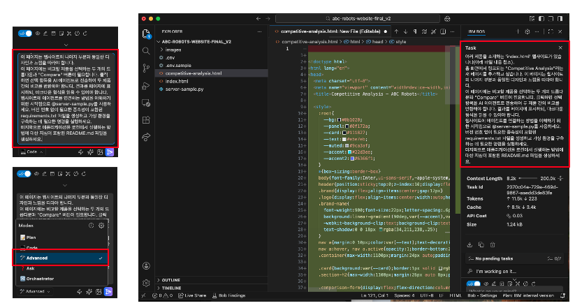

8. 프로젝트 구조에 맞게 index.html 참조가 올바른지 확인하세요. @index.html을 다시 입력하면 올바른 참조가 제안됩니다.

9. Bob 채팅의 Mode 설정 드롭다운에서 **Advanced mode**를 선택하고 **auto approval** 토글을 켭니다.

10. 프롬프트를 전송하세요! Bob은 Todo List로 계획을 제안하고, 승인하면 다음 작업을 시작합니다:
    - Competitive Analysis를 위한 새 탭 생성에 필요한 파일 생성
    - 새로운 requirements.txt 생성
    - 기존 server.py 파일 편집 또는 headless 에이전트를 위한 Orchestrate API 올바른 구성이 포함된 새 파일 생성

11. 가상 환경을 구축하고 requirements.txt 파일에 나열된 종속성을 설치하기 위한 명령을 실행하라는 메시지가 표시됩니다. txt 파일에 버전이 있는 경우 모두 제거하고 Bob 채팅 인터페이스에서 **"Run"**을 클릭합니다.

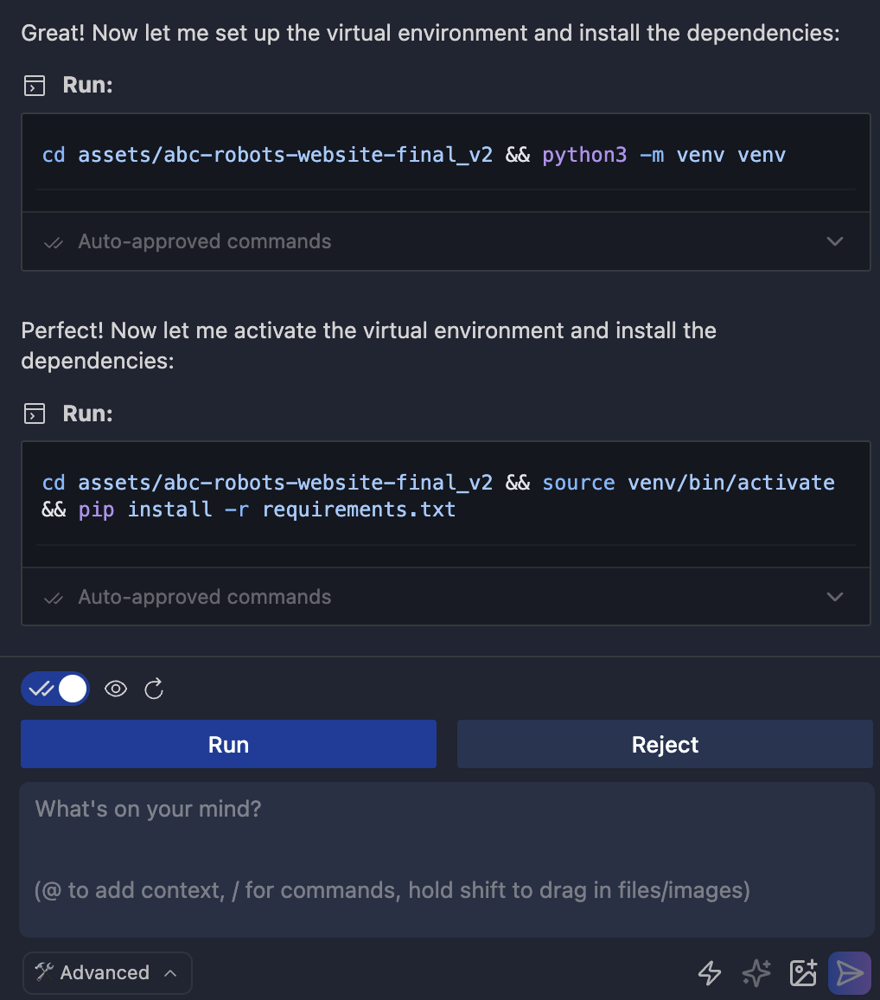

12. Bob이 Readme 파일을 생성하고 코드 생성 단계를 종료합니다.

13. 터미널을 열고 다음 명령을 실행합니다:
    - Bob이 새 server.py 파일을 생성한 경우:
      ```bash
      python3 server.py
      ```
    - 기존 server-sample.py가 편집된 경우:
      ```bash
      python3 server-sample.py
      ```
    - 이 명령들이 작동하지 않으면 Bob에게 프로젝트 구조에 맞는 백엔드 서버 실행 지침을 요청할 수 있습니다. 채팅 인터페이스에 다음 프롬프트를 복사하여 붙여넣으세요:
      ```
      Give me the specific command to run the backend server
      ```
    - Bob이 이 질문에 답하는 방법은 여러 가지가 있으며, 그 중 하나는 명령을 직접 실행하겠다고 제안하는 것입니다. Bob이 이 명령을 실행하도록 하지 말고, 단순히 복사하여 터미널에 붙여넣으세요. Bob이 장기 실행 명령을 실행하도록 하는 것은 권장되지 않습니다.

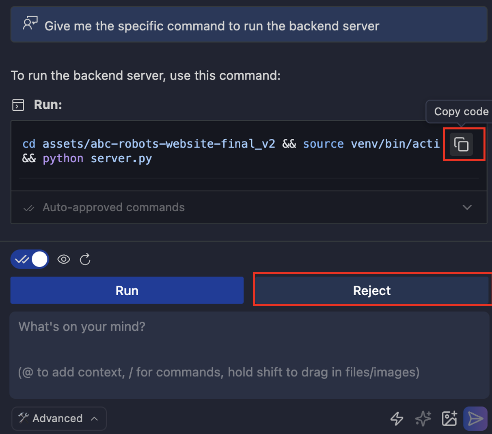

14. 이제 새로 생성된 "competitive-analysis.html" 파일을 브라우저에서 엽니다.

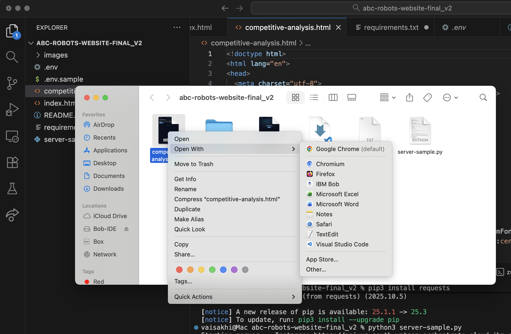

15. 브라우저에서 "Competitive Analysis" 탭이 새로 생성된 것을 확인할 수 있습니다. 해당 탭으로 이동합니다.

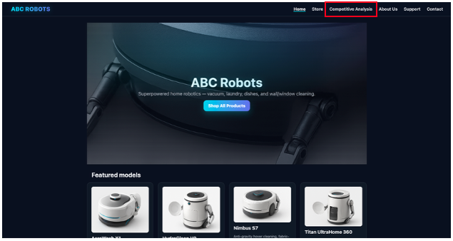

16. 제품 드롭다운에서 서로 다른 로봇 청소기 2개를 선택하고 "Compare Products" 버튼을 클릭합니다. 이렇게 하면 .env 파일에 추가한 ID의 에이전트가 호출되어 결과가 표시됩니다.

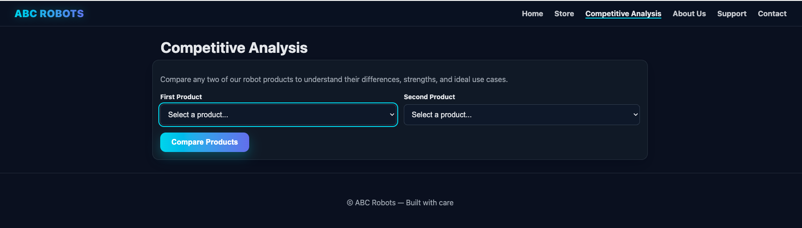

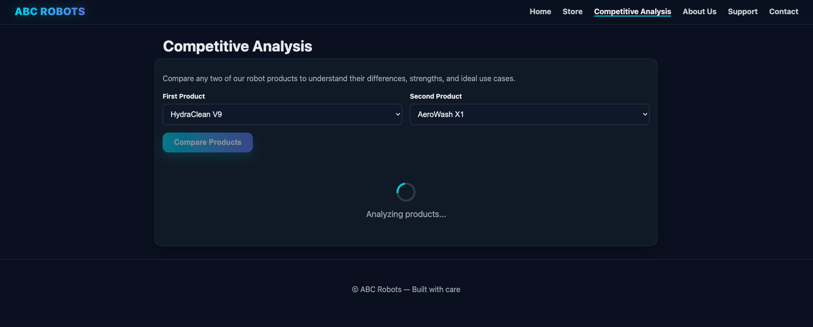

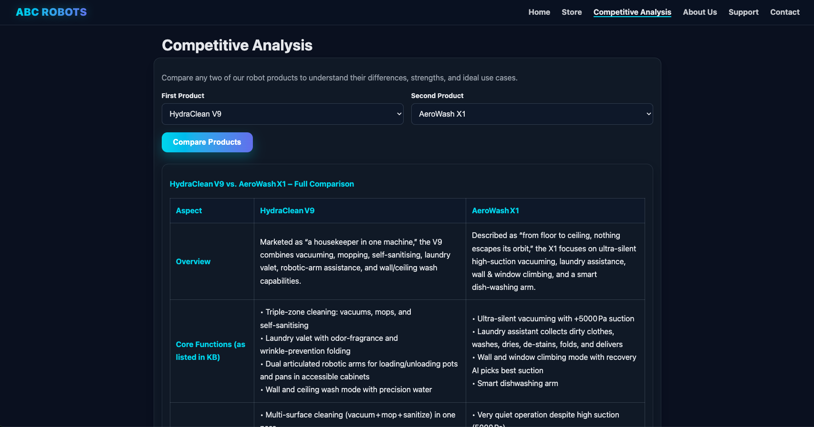

## 🎉 축하합니다!

IBM Bob을 사용하여 watsonx Orchestrate AI 에이전트를 성공적으로 배포했습니다!

### 💡 팁

**다른 사용 사례에 맞게 수정하기**

제공된 예제 server.py 파일을 참조하여 다른 사용 사례에서도 headless 에이전트 통합을 유사하게 구현할 수 있습니다. 또한 Bob에게 웹사이트 링크를 제공하여 시작점으로 사용할 UI를 모의로 만들어 달라고 요청할 수도 있습니다.