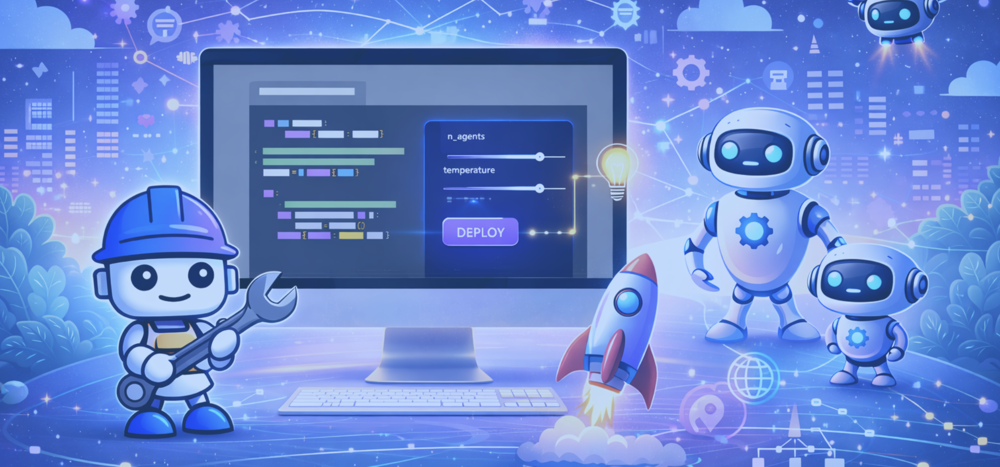
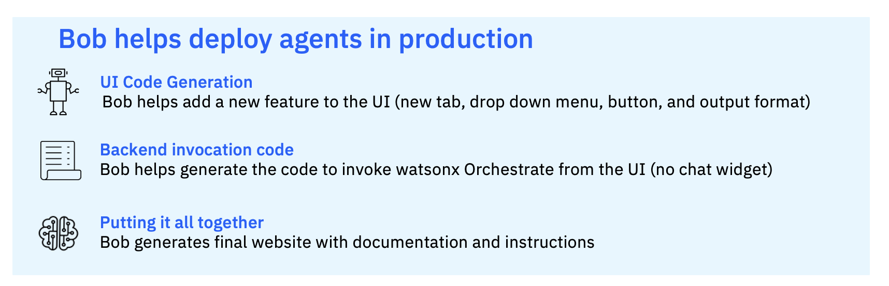

# 🚀 Bob을 사용하여 AI 에이전트를 프로덕션에 배포하기

## 🤖 목표

이 실습에서는 AI 소프트웨어 개발 파트너인 Bob이 여러분의 웹사이트에 AI 에이전트를 임베드하는 것을 도와줍니다.

## 🤔 문제점

로우코드 사용자, 비즈니스 사용자, 제품 관리자는 코딩 없이 watsonx Orchestrate에서 강력한 에이전트를 빠르게 구축할 수 있습니다. 그러나 이러한 에이전트를 프로덕션 시스템 또는 엔드투엔드 프로토타입 시스템으로 전환하려면 프론트엔드 개발자가 UI를 구축해야 합니다. 새 탭 추가, 기본 채팅 패널 연결, 에이전트에 입력 전송과 같은 간단한 변경 사항도 수동으로 수행하면 개발 및 테스트에 며칠이 걸릴 수 있으며, API, JavaScript, HTML 통합 등에 대한 적절한 이해가 필요합니다. 이는 요구사항 반복을 늦추고 실제 경험을 보고 클릭해야 하는 실제 이해관계자의 피드백을 지연시킵니다.

## 🎯 솔루션

이 실습에서는 IBM Bob과 vibe 코딩을 사용하여 기존 애플리케이션 UI에 새 탭을 빠르게 추가하고 이미 구축된 watsonx Orchestrate 에이전트에 연결하는 방법을 보여줍니다. 목표는 비전통적인 개발자와 제품 팀이 "에이전트 아이디어"에서 "클릭 가능한 프로토타입"으로 몇 분 만에 이동할 수 있도록 지원하여, 전체 구현에 착수하기 전에 에이전트 구현을 검증하고, 프롬프트를 개선하며, UX에 대해 조율할 수 있도록 하는 것입니다.

## 달성할 내용

이 실습을 완료하면 다음을 수행할 수 있습니다:

- 기존 웹사이트에 새로운 기능 탭을 생성하여 사용자 대면 기능을 확장합니다.
- 안전한 인증과 AI 에이전트와의 원활한 API 통합을 가능하게 하는 완전한 server.py를 생성합니다.
- 사전 구축된 watsonx Orchestrate 에이전트를 server.py 파일 내에 직접 통합합니다.
- 새로 생성된 탭에서 에이전트를 트리거하는 기능을 활성화하여 UI를 AI 에이전트에 연결합니다.

이 실습을 완료하면 (1) watsonx Orchestrate에 구축된 AI 에이전트를 배포하고 (2) Bob을 새로운 개발 동반자로 사용하는 자신감을 얻게 됩니다.

## 📈 비즈니스 가치

watsonx Orchestrate의 로우코드 에이전트 빌더와 IBM Bob의 코드 생성을 결합하면 팀은 훨씬 적은 엔지니어링 노력으로 더 많은 아이디어를 탐색할 수 있습니다.

- **더 빠른 프로토타이핑**: 자연어 프롬프트와 작은 참조 스니펫을 사용하여 새로운 UI 탭과 통합 코드를 생성하여 개념에서 작동하는 데모까지의 시간을 대폭 단축합니다.
- **비즈니스 사용자 역량 강화**: 제품 관리자와 도메인 전문가가 기존 코드베이스와 정렬을 유지하면서 최소한의 수동 코딩으로 Bob을 통해 UI 및 워크플로우 변경을 안전하게 주도할 수 있습니다.
- **더 나은 요구사항**: 초기의 현실적인 프로토타입은 이해관계자가 에이전트가 할 수 있는 것과 할 수 없는 것을 빠르게 이해하도록 도와 더 명확한 요구사항과 더 적은 재작업 주기로 이어집니다.
- **프로덕션 재사용**: 프로토타입이 검증되면 동일한 Bob 생성 탭과 통합 패턴을 처음부터 모든 것을 다시 작성하는 대신 프로덕션을 위해 강화하고 확장할 수 있습니다.

## 💡 사전 요구사항

- 유스케이스의 Competitive Analysis 실습 완료
- watsonx Orchestrate에 competitive analyst 에이전트가 배포되어 있는지 확인
- IBM Bob IDE 설치. [여기](https://bob.ibm.com/trial)에서 IBM Bob Trial에 가입하세요.

## 📄 실습 가이드

실습을 시작하려면 [여기](../../../bob-competitive-deploy.html)의 상세 지침을 따르세요.