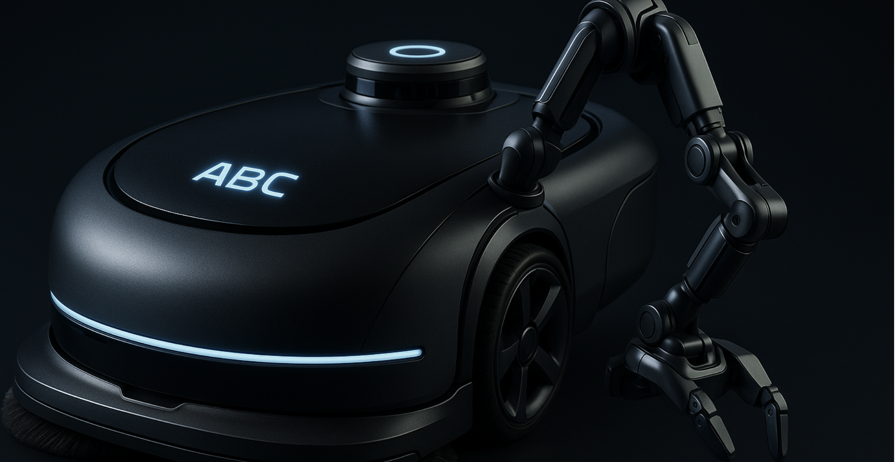
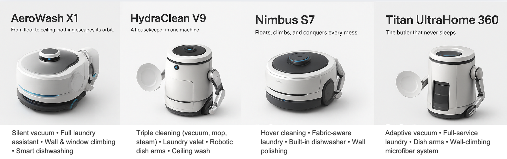
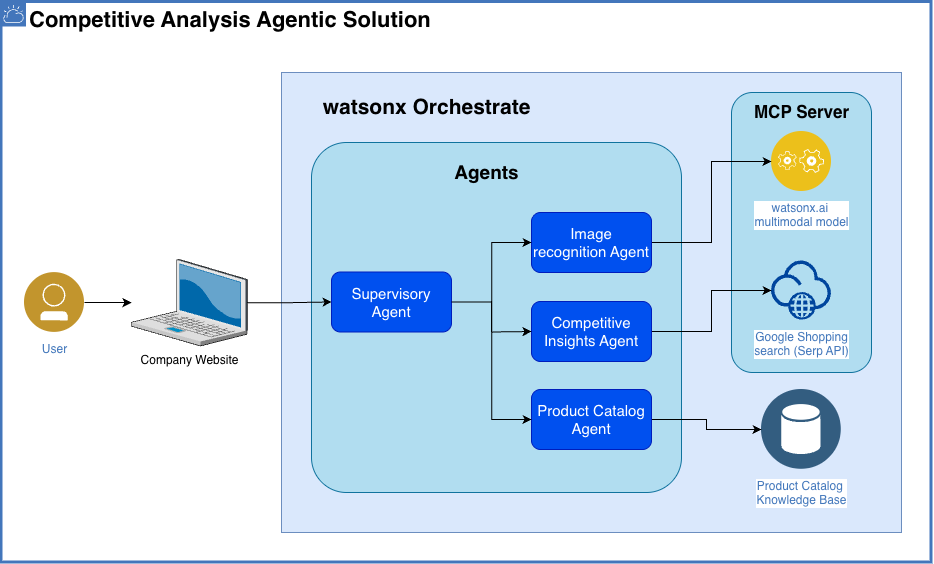

# 🥇 에이전트 기반 경쟁 인텔리전스

**기술 스택:** 이미지 인식 | MCP | RAG | 멀티 에이전트 오케스트레이션 | 노코드

## 🤔 문제점

ABC Robots의 영업 부서는 새로운 고성능 가정용 청소 로봇 라인에 대한 영업 제안서를 준비하는 데 어려움을 겪고 있습니다. 새로운 모델을 출시할 때마다 경쟁 분석 팀은 인사이트를 제공하기 위해 많은 시간과 리소스를 소비합니다. 주요 문제점은 다음과 같습니다:

- **수동 리서치로 인한 의사결정 지연 및 생산성 저하**
- **약한 포지셔닝으로 인한 영업 차별화 어려움**
- **실시간 인텔리전스 부재로 시장 변화에 대한 느린 대응**

## 🎯 목표

ABC Robots는 시장 조사 및 경쟁사 분석을 자동화하기 위해 AI 기반 경쟁 인텔리전스 시스템을 구현할 계획입니다. 이 시스템은 영업 팀이 경쟁사 대비 제품을 신속하게 식별하고 포지셔닝하는 데 도움을 주어, 수동 리서치의 비효율성과 오래된 인사이트 문제를 극복합니다.

### 시스템 목표

AI 기반 시스템을 통해 경쟁 분석 및 시장 조사를 지원하며, 다음 기능을 제공합니다:

1. **제품 카탈로그에서 제품 추출**
2. **각 제품의 주요 기능 식별 및 추출**
3. **주요 속성을 기반으로 경쟁사 제품 검색**
4. **가격, 기능 및 차별화 요소가 포함된 구조화된 경쟁 비교 표 생성**
5. **SWOT 분석 수행** (강점, 약점, 기회, 위협)을 통한 심층적인 전략적 인사이트 제공

이러한 작업을 자동화함으로써 회사는 영업 프로세스를 가속화하고, 데이터 정확성을 개선하며, 영업 팀이 더 빠르게 정보에 입각한 의사결정을 내릴 수 있도록 지원합니다.

## 🏛 아키텍처

### 시스템 구성 요소

1. **이미지 인식**: 제품 카탈로그에서 시각적 정보 추출
2. **MCP (Model Context Protocol)**: 다양한 AI 모델 간 통신 및 조율
3. **RAG (Retrieval-Augmented Generation)**: 관련 정보 검색 및 생성
4. **멀티 에이전트 오케스트레이션**: 여러 AI 에이전트의 협업 관리
5. **노코드 인터페이스**: 기술 전문 지식 없이도 시스템 구성 가능

## 📝 단계별 실습 가이드

단계별 실습 가이드는 여기에서 확인하실 수 있습니다:

[단계별 실습 가이드](./handson_guide.md)
