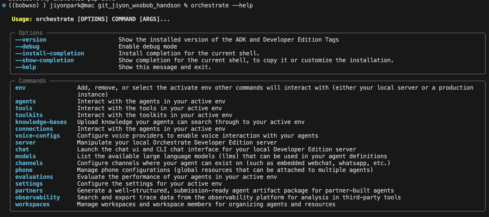
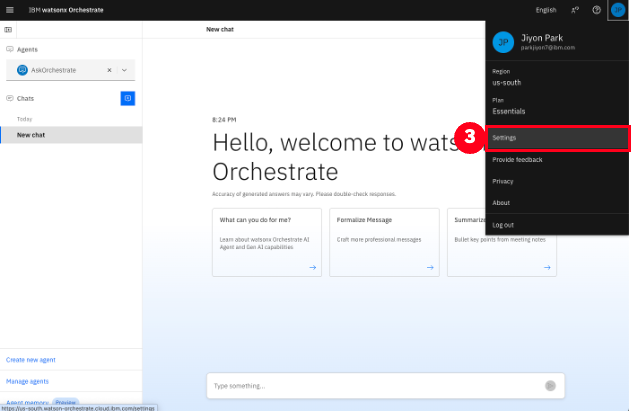
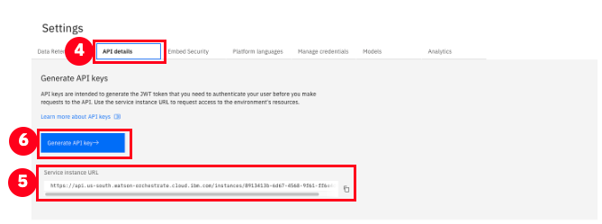
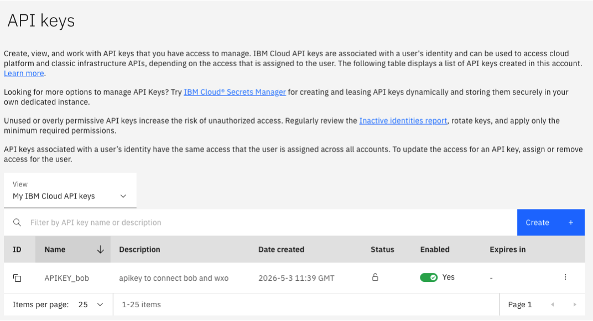
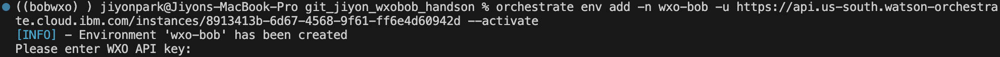
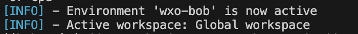
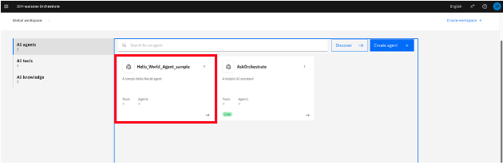

# wxo_bob_handson
wxo x Bob handson asset

> **원본 튜토리얼**: [Getting started with watsonx Orchestrate](https://developer.ibm.com/tutorials/getting-started-with-watsonx-orchestrate/)

## IBM watsonx Orchestrate Agent Development Kit (ADK) 튜토리얼

IBM watsonx Orchestrate는 에이전트를 구축, 테스트 및 관리하기 위한 개발자 중심 도구 세트인 Agent Development Kit (ADK)를 포함하고 있습니다. ADK를 사용하면 개발자는 경량 프레임워크와 간단한 CLI를 사용하여 강력한 에이전트를 설계할 수 있는 자유와 제어권을 얻을 수 있습니다. 명확한 YAML 또는 JSON 파일로 에이전트를 정의하고, 사용자 정의 Python 도구를 생성하며, 몇 가지 명령만으로 전체 에이전트 라이프사이클을 관리할 수 있습니다.

이 튜토리얼에서는 ADK를 설치하고, 로컬 개발 환경을 설정하며, watsonx Orchestrate SaaS 인스턴스에 첫 번째 에이전트를 배포하는 단계별 가이드를 따라갑니다. 이를 통해 유연하고 재사용 가능한 AI 에이전트를 바로 구축할 수 있습니다.

## watsonx Orchestrate Agent Development Kit (ADK) 환경 설정

## Python 설치

ADK를 설치하기 전에 호환되는 Python 버전(3.11~3.13)이 컴퓨터에 설치되어 있는지 확인하세요.

터미널 창을 열고 다음 명령을 실행하여 현재 Python 버전을 확인하세요:

```bash
python --version
```

버전이 3.11-3.13 범위를 벗어나는 경우 호환되는 버전을 설치해야 합니다. [공식 Python 웹사이트](https://www.python.org/downloads/)에서 특정 릴리스를 다운로드하거나, macOS 또는 Linux를 사용하는 경우 `pyenv`와 같은 버전 관리자를 사용하여 여러 Python 버전을 관리하고 필요한 버전을 설치할 수 있습니다.

Python을 설치한 후 Python의 패키지 설치 프로그램인 pip도 설치되어 있는지 확인하세요. 터미널에서 다음 명령을 실행하세요:

```bash
pip --version
```


## Python 가상 환경 생성

ADK를 설치하기 전에 Python 가상 환경을 생성하는 것이 좋습니다. 이렇게 하면 에이전트 종속성을 격리하여 쉽게 관리할 수 있습니다.

프로젝트 폴더에서 다음 명령을 사용하여 가상 환경을 생성하세요:

```bash
python -m venv venv
```

다음으로 가상 환경을 활성화합니다.

**macOS/Linux:**

```bash
source venv/bin/activate
```

**Windows:**

```bash
venv\Scripts\activate
```


## ADK 설치

가상 환경이 활성화된 상태에서 ADK를 설치합니다:

```bash
pip install ibm-watsonx-orchestrate
```

설치 프로세스가 완료되면 다음 명령으로 인스턴스가 제대로 작동하는지 확인하세요:

```bash
orchestrate --help
```


설치가 성공적으로 완료되면 다음과 같은 화면을 볼 수 있습니다:




## ADK를 SaaS 환경에 연결하고 환경 활성화

이제 ADK를 설치했으므로 watsonx Orchestrate SaaS 인스턴스에 연결하여 에이전트를 SaaS 환경에 직접 배포할 수 있습니다.

인스턴스의 API Key와 Instance URL이 필요합니다. 다음 단계를 따르세요:

1. watsonx Orchestrate 인스턴스에 로그인합니다.
2. 오른쪽 상단의 프로필 아이콘을 클릭합니다.
3. 열리는 메뉴에서 **Settings**를 클릭합니다.





4. Settings 페이지에서 **API details** 탭으로 이동합니다.
5. **Service instance URL**을 복사합니다.
6. **Generate API key** 버튼을 클릭합니다.




다음 화면에서 **Create**을 누르고 API key를 명명하고 **Create** 합니다.


7. 새로운 API Key가 포함된 팝업이 나타납니다. 즉시 복사하여 안전한 곳에 저장하세요 (예: .txt 파일). 나중에 다시 볼 수 없습니다.





8. 터미널로 돌아가서 다음 명령을 실행하세요:

```bash
orchestrate env add -n <environment-name> -u <Service-instance-url> --type mcsp --activate
```

`<environment-name>`을 환경에 대해 선택한 이름으로, `<Service-instance-url>`을 이전에 복사한 서비스 인스턴스 URL로 바꾸세요.

예시:
```bash
orchestrate env add -n wxO-AWS -u https://api.dl.watson-orchestrate.ibm.com/instances/20250605-1433-1621-306a-df42bcdd849c --type mcsp --activate
```

> **중요:** 이 핸즈온에서는 공용 환경을 사용하고 있으므로, `<environment-name>`을 **본인 이름 + wxo** 형식으로 지정해주세요.
> 예: `jiyon-wxo`, `hong-wxo`, `kim-wxo` 등


## 환경 관리 명령어

**환경 삭제:**
```bash
orchestrate env remove -n <environment-name>
```

**환경 목록 보기:**
```bash
orchestrate env list
```

**환경 활성화:**
```bash
orchestrate env activate -n <environment-name>
```


환경이 이미 생성되었지만, 이제 터미널에서 API Key를 입력하라는 메시지가 표시되어 환경을 활성화할 수 있습니다.



터미널에 API Key를 붙여넣고 키보드의 Enter 키를 눌러 확인하세요. 모든 것이 정상적으로 작동하면 환경이 성공적으로 생성되고 이미 활성화되었다는 메시지가 표시됩니다.





## 첫 번째 에이전트 정의하기

ADK가 watsonx Orchestrate SaaS 인스턴스에 연결되었으므로, 간단한 에이전트를 게시하여 설정을 테스트할 준비가 되었습니다.

watsonx Orchestrate에서 에이전트는 YAML 또는 JSON 파일로 정의됩니다. 에이전트 사양 파일은 이름, 종류, LLM에 대한 지침 및 사용할 수 있는 도구와 같은 에이전트의 핵심 세부 정보를 설명합니다.

ADK로 에이전트를 구축할 때 이 사양을 직접 작성하여 에이전트가 수행할 수 있는 작업과 동작 방식을 완전히 제어할 수 있습니다. 더 고급 에이전트에는 사용자 정의 도구, 협력자 또는 통합이 포함될 수 있지만, 지금은 최소한의 Hello World 에이전트로 시작하겠습니다.

에이전트용 YAML 파일을 생성하고 파일 이름을 `hello-world-agent.yaml`로 지정하세요.

📥 **[hello-world-agent.yaml 다운로드](agents/hello-world-agent.yaml)**

원하는 텍스트 편집기로 생성된 파일을 열고 다음 코드를 복사하여 붙여넣으세요.

> **중요:** `name` 필드를 **Hello_World_Agent_<본인이름>** 형식으로 변경해주세요.
> 예: `Hello_World_Agent_jiyon`, `Hello_World_Agent_hong` 등

```yaml
spec_version: v1
kind: native
name: Hello_World_Agent_<본인이름>
description: A simple Hello World agent
instructions: >
  You are a test agent created for a tutorial on how to get started with watsonx Orchestrate ADK. 
  When the user asks "who are you", respond with: I'm the Hello World Agent. Congratulations on completing the Getting Started with watsonx Orchestrate ADK tutorial!
llm: watsonx/meta-llama/llama-3-2-90b-vision-instruct
style: default
collaborators: []
tools: []
```


## 에이전트 Import하기

파일을 저장한 후 터미널로 돌아가서 파일을 생성한 디렉토리로 이동합니다. 그런 다음 다음 명령을 실행하여 에이전트를 import합니다:

```bash
orchestrate agents import -f hello-world-agent.yaml
```

import가 성공하면 터미널에 확인 메시지가 표시됩니다. 다음 이미지에서 사용자가 터미널에서 Desktop으로 이동하고, hello-world-agent.yaml 파일을 생성한 다음 에이전트를 import하는 예시를 볼 수 있습니다:


## SaaS 인스턴스에서 에이전트 확인하기

이제 watsonx Orchestrate SaaS 인스턴스로 돌아가서 왼쪽 상단의 탐색 메뉴 버튼을 클릭하여 메인 메뉴를 확장합니다. 그런 다음 **Build**를 클릭한 후 **Agent Builder**를 클릭합니다.


이제 Agent Builder 화면에 있습니다. 방금 import한 hello_world_agent와 이전에 watsonx Orchestrate 테넌트에 import된 다른 에이전트들(있는 경우)을 볼 수 있습니다. hello_world_agent를 클릭하여 엽니다.





## 에이전트 테스트하기

이제 에이전트의 구성 화면에 있습니다. 여기에서 watsonx Orchestrate의 Agent Builder로 에이전트를 구축하기 위한 모든 옵션을 볼 수 있습니다. Agent Builder는 코드 없이 에이전트를 구축할 수 있는 노코드 빌딩 경험입니다. 

아래로 스크롤하여 모든 옵션을 확인하면서 Description 및 Instructions 필드가 hello-world-agent.yaml 파일의 내용과 일치하는지 확인하세요. 원하는 경우 여기에서 에이전트를 추가로 사용자 정의할 수 있지만, 최종 테스트를 수행해보겠습니다.

화면 오른쪽에는 에이전트와 상호 작용할 수 있는 테스트 채팅이 있습니다. 채팅에 "Who are you?"를 입력한 다음 Enter 키를 눌러 전송하고 에이전트의 응답을 확인하세요.


## 요약

이 튜토리얼에서는 환경을 설정하고, ADK를 설치하며, 첫 번째 에이전트를 정의했습니다.
