# 👨🏻‍💻 사용 사례: 경쟁 분석

## 🏛 아키텍처


## 사용 사례 설명

ABC Robots는 시장 조사 및 경쟁사 분석을 자동화하기 위해 AI 기반 경쟁 인텔리전스 시스템을 구현할 계획입니다. 이 시스템은 영업 팀이 경쟁사 대비 제품을 신속하게 식별하고 포지셔닝하는 데 도움을 주어, 수동 리서치의 비효율성과 오래된 인사이트 문제를 극복합니다. 목표는 다음을 통해 경쟁 분석 및 시장 조사를 지원하는 AI 기반 시스템을 구축하는 것입니다:

- 회사의 제품 카탈로그에서 제품 추출
- 각 제품의 주요 기능 식별 및 추출
- 주요 속성을 기반으로 경쟁사 제품 검색
- 가격, 기능 및 차별화 요소가 포함된 구조화된 경쟁 비교 표 생성

이러한 작업을 자동화함으로써 회사는 영업 프로세스를 가속화하고, 데이터 정확성을 개선하며, 영업 팀이 더 빠르게 정보에 입각한 의사결정을 내릴 수 있도록 지원합니다.

## 사전 요구사항

### 참가자:

- 이 실습에 적합한 TechZone 환경에 대한 액세스 권한이 있는지 확인하세요.
- API 키 생성 및 프로젝트 설정 단계는 환경 설정 가이드를 완료하세요.
- 강사가 MCP 서버에 연결할 URL을 제공했는지 확인하세요.
- 지식으로 로드할 **[Vaccum_cleaners_v2.docx](Vaccum_cleaners_v2.docx)** 파일을 다운로드하세요.
- 웹사이트에 채팅을 임베드할 **[abc-robots-website-final.zip](abc-robots-website-final.zip)** 파일을 다운로드하세요.
- 강사가 필요한 모든 자격 증명을 제공했는지 확인하세요.

## 실습 단계 개요

1. watsonx Orchestrate에 연결
2. Identifier Agent 생성 - MCP Tool `extract_from_image` 사용
3. Comparison Analysis Agent 생성 - MCP Tool `search_and_review_high_rated_products` 사용
4. ABC Robots Agent 생성 - RAG 에이전트
5. Master Agent 생성 - 오케스트레이터 에이전트

시작하겠습니다.

## 실습 지침

### 할당된 Watsonx Orchestrate 인스턴스에 연결

1. IBM Cloud(cloud.ibm.com)에 로그인합니다.
2. 왼쪽 상단의 햄버거 메뉴로 이동한 다음 **Resource List**로 이동합니다.
3. **AI/Machine Learning** 섹션을 엽니다.
4. **watsonx Orchestrate** 서비스가 표시됩니다. 클릭하여 엽니다.

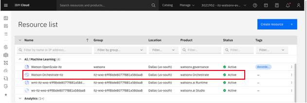

5. **Launch watsonx Orchestrate** 버튼을 클릭합니다.

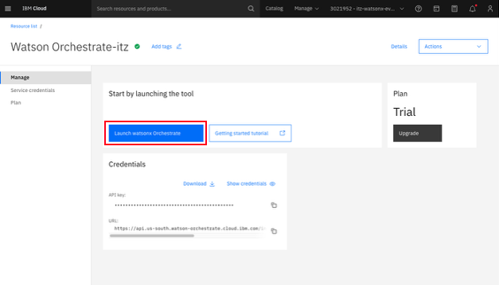

## Identifier Agent 생성

Identifier Agent는 이미지에서 제품을 인식합니다. 이 에이전트는 이미지 인식을 위해 watsonx.ai에서 호스팅되는 멀티모달 모델을 호출하는 MCP 서버에 사전 배포된 서비스를 사용합니다. 이 서비스를 watsonx Orchestrate 에이전트에 통합해 보겠습니다.

> **팁**
> 
> MCP 서버는 Model Context Protocol(MCP)의 구현을 실시간으로 배포한 것으로, 외부 도구, 데이터 및 서비스에 안전하고 일관되게 표준화된 액세스를 제공합니다.

1. watsonx Orchestrate 홈 페이지로 이동하여 햄버거 메뉴(☰)를 클릭하고 **Build**를 선택한 다음 **Agent Builder**를 선택합니다.

2. **Create agent** 버튼을 클릭합니다.

   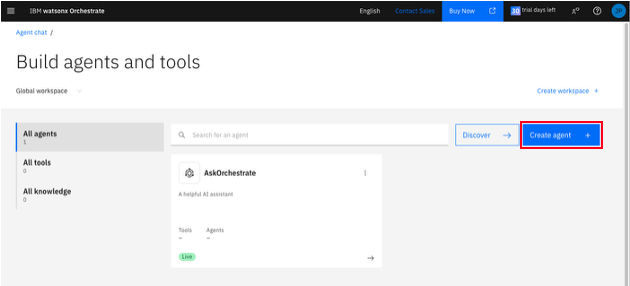

3. **Create from scratch**를 선택하고 다음 정보를 추가합니다:

   **Name:**
   ```
   Identifier Agent-<본인이름>
   ```
   예시: `Identifier Agent-jiyon`

   **Description:**
   ```
   This agent will extract the brand name and product name from the image.
   ```

4. **Create** 버튼을 클릭합니다.

   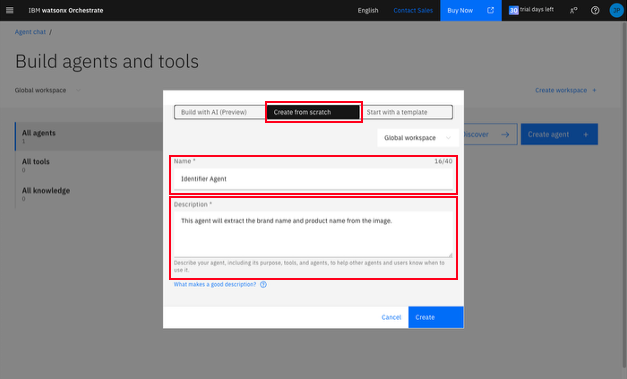

5. **Toolset** 섹션으로 이동하여 **Add tool**을 클릭합니다.

   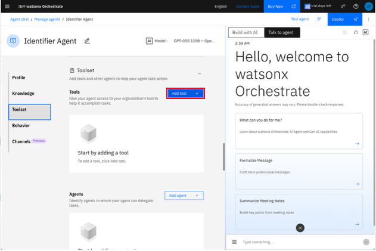

6. **Add from file or MCP server**를 선택합니다.

   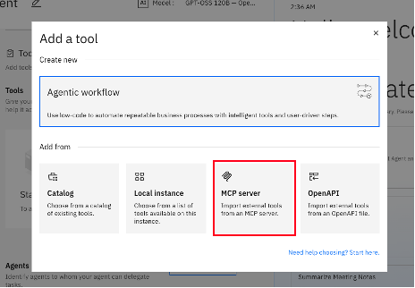

7. **Add tools and manage MCP servers** 창에서 **Add MCP server**를 클릭합니다.

   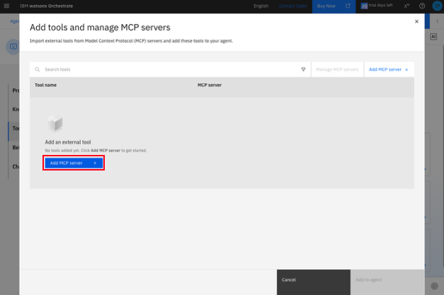

   **Remote MCP server**를 클릭하고 **Next**를 클릭합니다.

   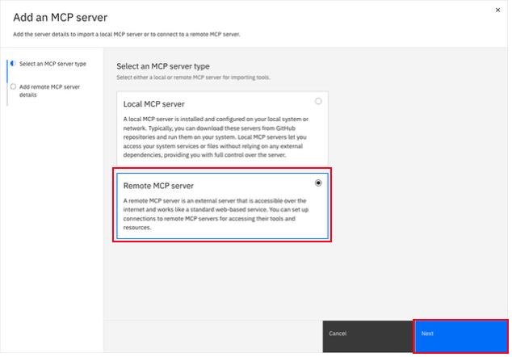

8. **Add MCP server** 창에서 다음 매개변수를 추가한 다음 **Connect**를 클릭합니다:

   **Server Name:**
   ```
   mcp-competitive-tools-<본인이름>
   ```
   예시: `mcp-competitive-tools-jiyon`

   **MCP Server URL:**
   강사로부터 받은 MCP Server URL을 입력합니다.
   
   예시:
   ```
   https://remote-mcp-tools.29gh2180kcpr.us-south.codeengine.appdomain.cloud/sse
   ```

   **Transport Type:**
   **Server-Sent Events**를 선택합니다.

   모든 정보를 입력한 후 **Connect** 버튼을 클릭합니다.

   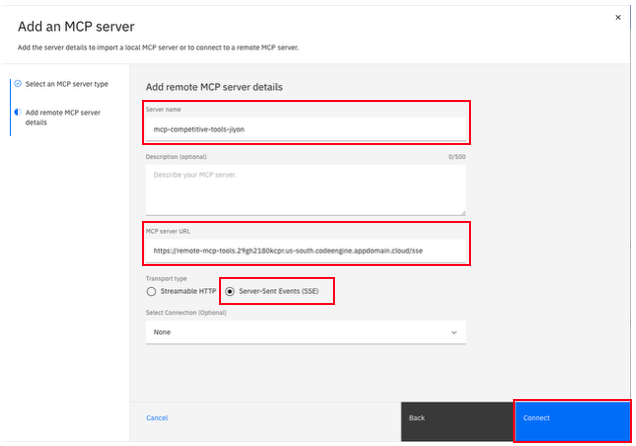

9. **Add tools and manage MCP servers** 창에서 **extract_from_image**를 체크하고 **Add to agent**를 클릭합니다.

   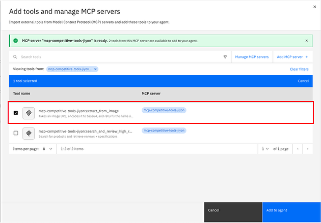

10. 그러면 **Tools**에 추가된 것을 다음 화면과 같이 볼 수 있습니다.

    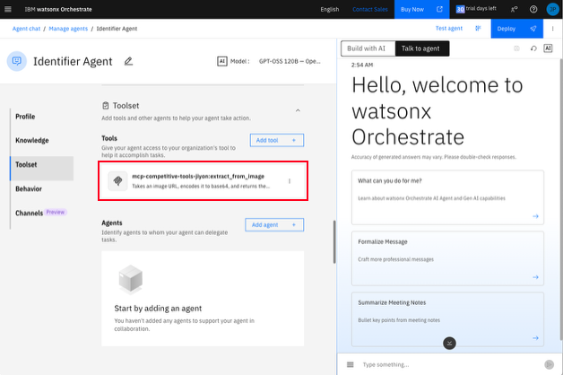

11. 이제 **Behavior** 섹션에서 에이전트가 수행해야 할 작업을 정의해 보겠습니다. 이미지 인식 에이전트에서 원하는 형식을 구체적으로 지정합니다. 다음 **Instructions**를 입력하세요:

    ```
    I will share an image URL. Please use the extract_from_image tool to parse the content. From the extracted text or context, identify the exact product name and brand name from the reference image. This information will be used by the Competitive Analysis Agent.

    Return the result in this format:

    Brand Name :

    Product Name:
    ```

    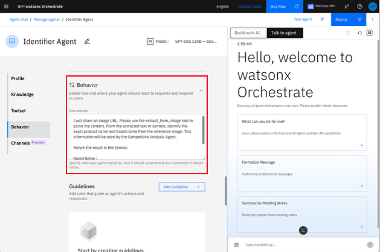

12. 다음 이미지를 로드하여 에이전트를 즉시 테스트해 보겠습니다. 에이전트가 제품을 인식할 수 있도록 해당 URL을 전달합니다:

    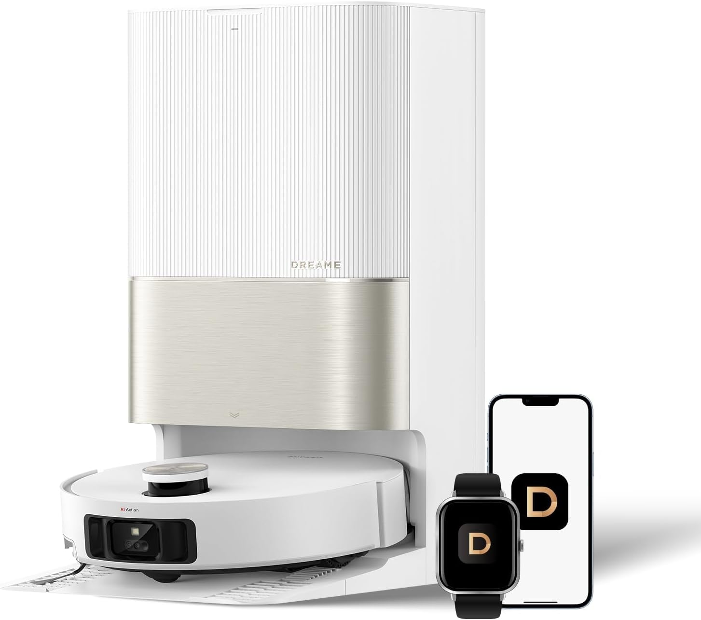

13. 오른쪽 **Preview** 창의 채팅에 다음 쿼리를 입력합니다:

    ```
    Tell me what product is in this image https://m.media-amazon.com/images/I/613mvDKX1hL._AC_SL1500_.jpg
    ```

    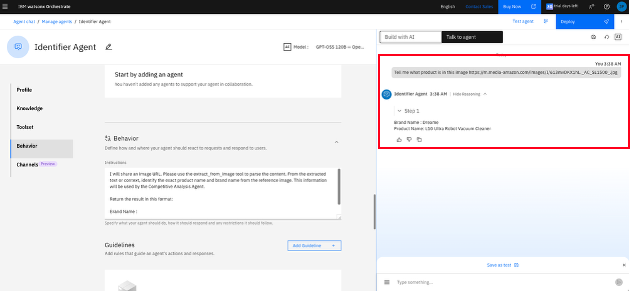

14. 이제 에이전트를 배포할 수 있습니다. **Deploy** 버튼을 클릭한 다음 **Pre-deployment summary** 창에서 다시 **Deploy**를 클릭합니다.

    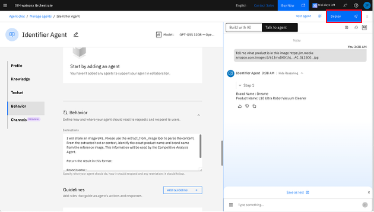

    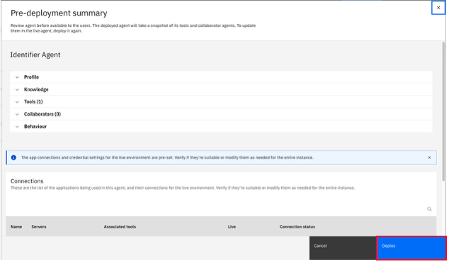

15. 이제 에이전트가 **Live** 상태이며 직접 채팅할 수 있습니다. 이는 실습 후반부에서 시연하겠습니다.

    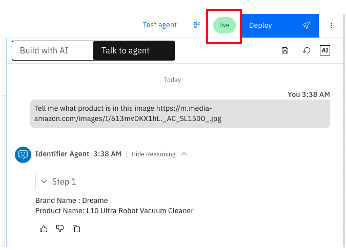

## Comp Analysis Agent 생성

이제 Comp Analysis Agent를 생성해 보겠습니다. 이 에이전트는 Google Search 및 Google Shopping API를 사용하여 시장의 제품 정보를 가져올 수 있습니다.

SerpAPI를 사용하여 이러한 서비스를 호출한 다음 MCP 서버에서 도구로 노출하여 watsonx Orchestrate의 에이전트에서 더 쉽게 호출할 수 있도록 합니다.

1. 왼쪽 상단의 breadcrumb 메뉴에서 **Manage Agents** 링크를 클릭합니다.

   

2. **Create agent** 버튼을 선택합니다.

   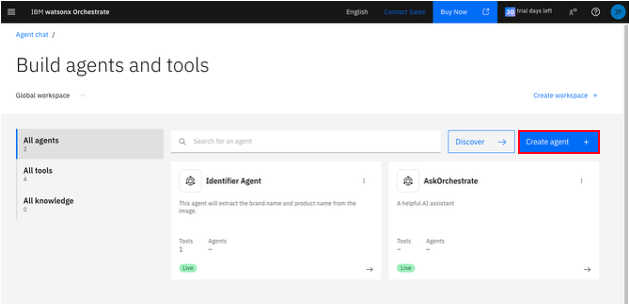

3. **Create from scratch**를 선택합니다.

   **Name:**
   ```
   Comp Analysis Agent-<본인이름>
   ```
   예시: `Comp Analysis Agent-jiyon`

   **Description:**
   ```
   Provides elaborate, very detailed analysis using a tool.
   ```

4. **Create** 버튼을 클릭합니다.

5. **Toolset** 섹션으로 이동하여 **Add tool** 버튼을 클릭합니다.

   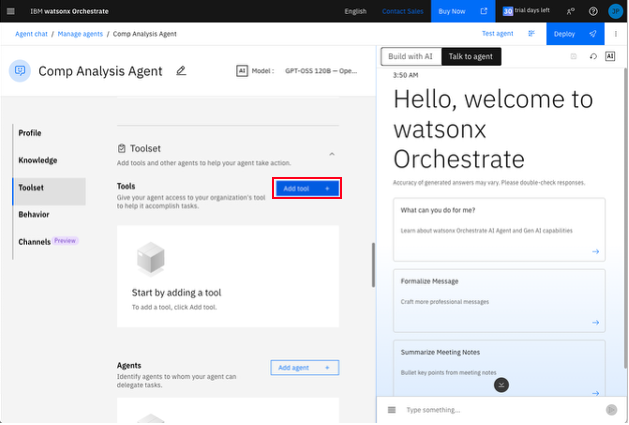

6. **MCP server**를 선택합니다.

   

7. **Manage MCP server**를 클릭합니다.

   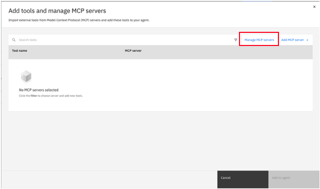

8. 이전에 생성한 MCP 서버(`mcp-competitive-tools-<본인이름>`)를 클릭합니다.

   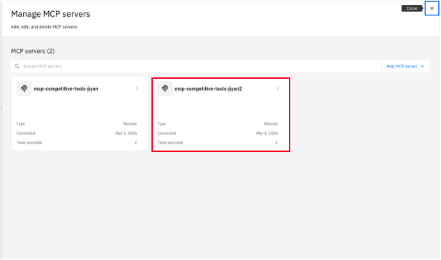

9. **search_and_review_high_rated_products**를 체크하고 **Add to agent**를 클릭합니다.

   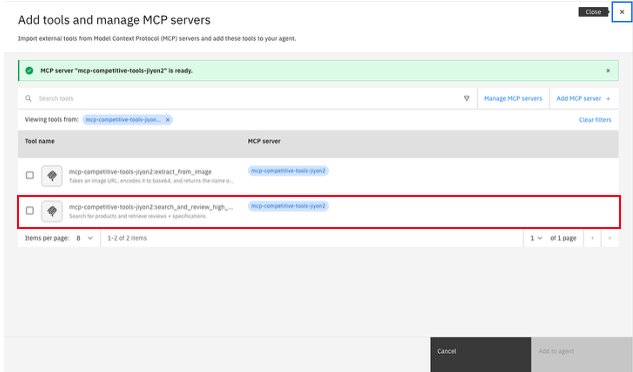

10. **Behavior** 섹션에서 **Instructions** 텍스트 필드에 다음을 추가합니다:

    ```
    When given a product name, use the search_and_review_high_rated_products tool to retrieve the content for the user's query.
    ```

    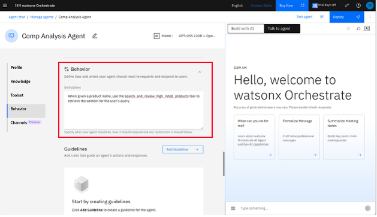

11. 이제 에이전트를 테스트할 수 있습니다. 오른쪽 하단 **Preview** 창의 텍스트 입력 상자에 다음 쿼리를 추가합니다:

    ```
    Give me details of the Dreame L10 Pro.
    ```

    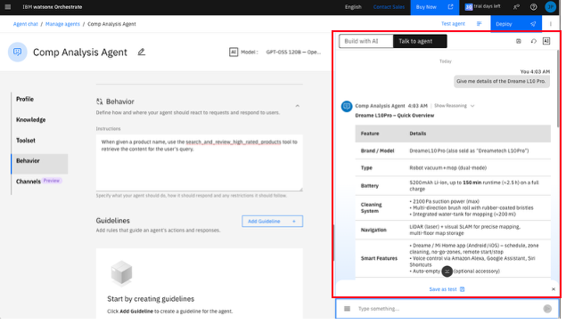

12. 이제 에이전트를 배포할 수 있습니다. **Deploy** 버튼을 클릭한 다음 **Pre-deployment summary** 창에서 다시 **Deploy**를 클릭합니다.

13. 에이전트가 **Live** 상태인지 확인합니다.

## ABC Robots Agent 생성

이 에이전트는 ABC Robots의 제품 카탈로그에서 정보를 가져옵니다. 실제 환경에서는 제품 정보가 데이터베이스나 다른 유형의 엔터프라이즈 리포지토리에 있을 수 있습니다. 간단하게 하기 위해 제품 카탈로그가 포함된 PDF를 업로드합니다. 카탈로그에는 다음 제품들이 포함되어 있습니다:


1. 왼쪽 상단의 breadcrumb 메뉴에서 **Manage Agents** 링크를 클릭합니다.

   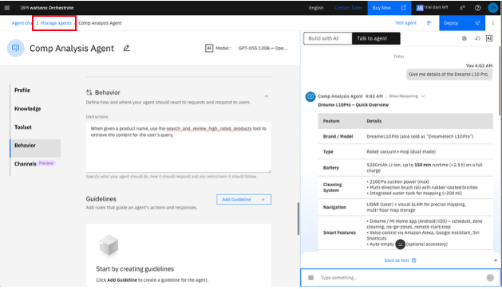

2. **Create agent** 버튼을 선택합니다.

   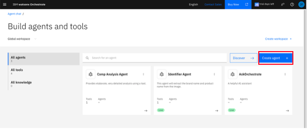

3. **Create from scratch**를 선택합니다.

   **Name:**
   ```
   ABC Robots Agent-<본인이름>
   ```
   예시: `ABC Robots Agent-jiyon`

   **Description:**
   ```
   This agent will answer questions using the uploaded knowledge base. Always interpret the user's input as a query to the knowledge base. The user will ask queries related to robotic vacuum cleaners only as the knowledge base contains that information.
   ```

4. **Create** 버튼을 클릭합니다.

5. **Knowledge Source** 섹션에서 **Choose knowledge** 버튼을 클릭합니다.

   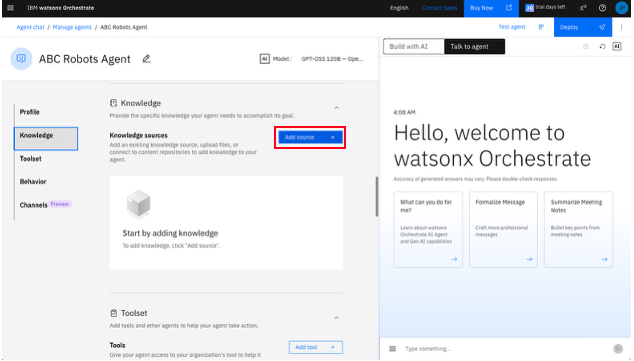

6. **New knowledge**를 클릭합니다.

   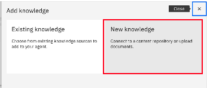

7. **Upload files**를 선택한 다음 **Next**를 클릭합니다.

   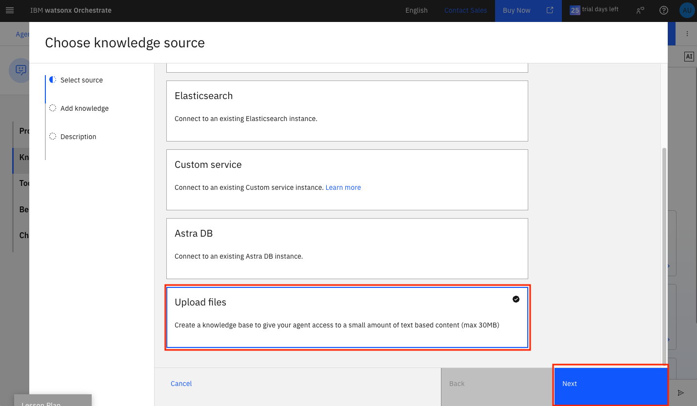

8. 제공된 `Vacuum_cleaners_v2.docx` 문서를 업로드하고 **Next** 버튼을 클릭합니다.

   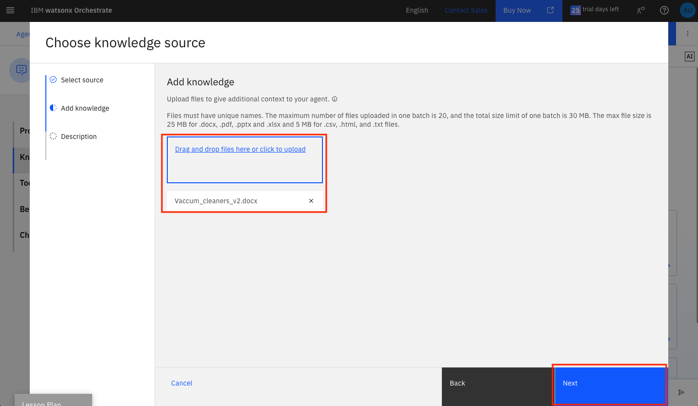

9. 다음 정보를 입력한 다음 **Save**를 클릭합니다.

   **Name:**
   ```
   Vacuum_cleaners_v2
   ```

   **Description:**
   ```
   This knowledge document contains all the product-related information for ABC Robots. All queries related to the product will be addressed using this document as the primary source.
   ```

   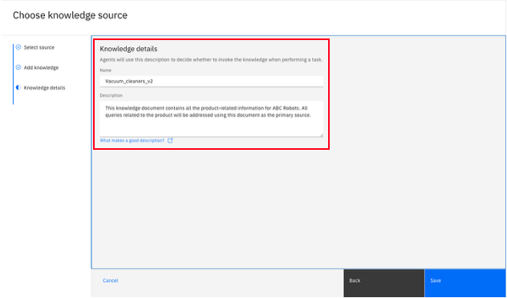

10. 위의 모든 단계를 완료하면 지식 소스가 추가되고 아래 이미지와 같이 표시됩니다.

    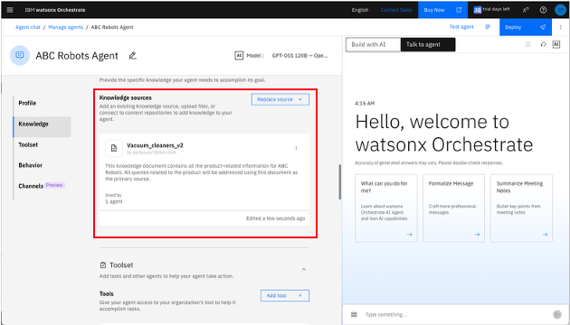

11. Knowledge 옆의 점 세 개(⋮)를 클릭하고 **Edit details**를 선택합니다.

    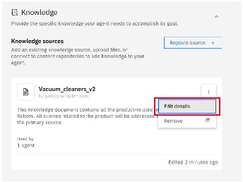

12. **Edit knowledge settings**를 클릭합니다.


13. **Dynamic**을 선택하고 **Maximum Search Results**를 **10**으로 설정한 후 **Save** 버튼을 클릭합니다.

    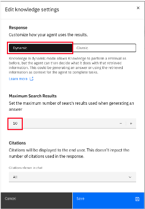

14. **Behavior** 섹션에서 **Instructions** 텍스트 필드에 다음을 추가합니다:

    ```
    Specs query → Structured summary of that product from KB (exact text, no paraphrasing).
    Comparison query → Generate a side-by-side comparison from KB. Each distinct function, feature, or specification must be presented as a separate row in the table (e.g., individual rows for "Cleaning Modes", "Battery Life", "Navigation System", "Dustbin Capacity", etc.). Do not consolidate multiple features into grouped rows like "Core Functions" or "Main Features".
    Competitive analysis vs KB → Compare a given product (if in KB) vs all KB products.
    No relevant data → Output strictly:

    The information required cannot be found in the current knowledge base. Please upload the relevant data in a supported format (e.g., CSV, TSV, or text document).
    ```
    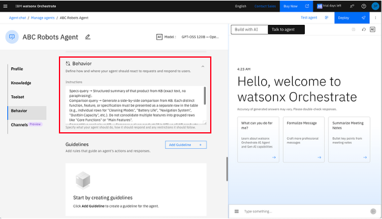

15. 이제 에이전트를 테스트할 수 있습니다. ABC Robots 제품에 대한 질문이나 특정 제품에 대한 정보를 요청해 보세요. 오른쪽 **Preview** 창에서 다음 쿼리를 시도해 보세요:

    ```
    Give me the list of products for ABC robots
    ```

    또는

    ```
    Give me information for the Nimbus S7
    ```

16. 이제 에이전트를 배포할 수 있습니다. **Deploy** 버튼을 클릭한 다음 **Pre-deployment summary** 창에서 다시 **Deploy**를 클릭합니다.

17. 에이전트가 **Live** 상태인지 확인합니다.

## Master Agent 생성

Master Agent는 사용자의 요청에 따라 적절한 에이전트를 선택하는 오케스트레이터 역할을 합니다. 이 에이전트는 세 개의 전문 에이전트(Identifier Agent, Comp Analysis Agent, ABC Robots Agent)를 조율하여 경쟁 분석 작업을 완료합니다.

1. 왼쪽 상단의 breadcrumb 메뉴에서 **Manage Agents** 링크를 클릭합니다.

2. **Create agent** 버튼을 선택합니다.

3. **Create from scratch**를 선택합니다.

   **Name:**
   ```
   Master Agent-<본인이름>
   ```
   예시: `Master Agent-jiyon`

   **Description:**
   ```
   You are an intelligent assistant; you have the capability of choosing agents based on the user's request. Ensure to follow the behavior strictly.
   ```

4. **Create** 버튼을 클릭합니다.

   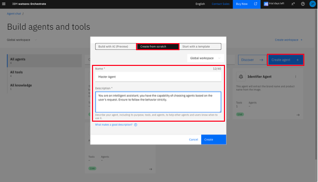

5. **Agents** 섹션에서 **Add agent** 버튼을 클릭합니다.

   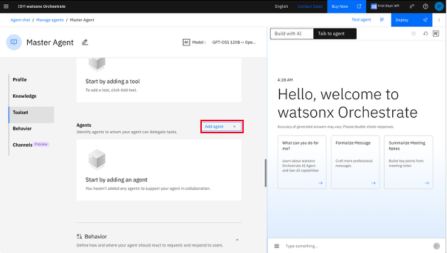

6. **Add from local instance**를 클릭합니다.

   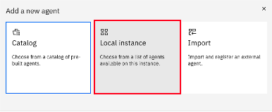

7. **ABC Robots Agent**, **Comp Analysis Agent**, **Identifier Agent**를 선택한 다음 **Add to Agent** 버튼을 클릭합니다.

   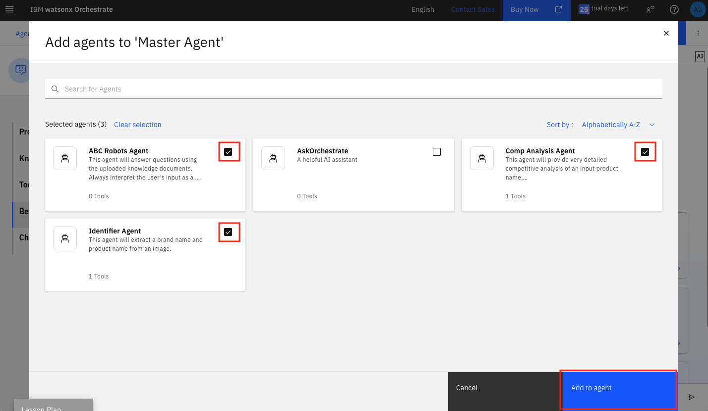

8. **Behavior** 섹션에서 **Instructions** 텍스트 필드에 다음을 추가합니다:

   ```
   The Master Agent does not answer queries directly. Its only responsibility is to route queries to the appropriate specialised agents, manage state between interactions, and ensure downstream queries are context-aware.
   Routing Rules
   Image-based Product Identification:
   If a user query contains an image or explicitly asks "Tell me what product is in the image," route the query to the Identifier Agent.
   After the response is received from the Identifier Agent, display the brand name and model name and ask the user - "Would you like me to pull information for this product?".
   If the user answers "Yes," provide the output from the Identifier Agent to the comp-analysis-ag and, from the response received, analyze and understand the response to provide a detailed and very long answer, divided into specifications, features, and reviews only. Ensure there is no none response in the headers.
   Customer Perception Summary:
   If a user queries "Give me the summary of how this product is perceived by customers, broken down into good and bad," then provide a detailed breakdown of reviews divided into good and bad from the response already received from comp-analysis-ag.
   Competitive Analysis against Knowledge Base:
   If a user queries "Do a competitive analysis of this product against the knowledge base," then a detailed comparison needs to be done between the response already received from comp-analysis-ag and the knowledge base from ABC Robots (all the products). Extract all information from the knowledge base and compare all features, price, and ratings against comp-analysis-ag. Understand and analyze, then provide that response in a detailed and long tabular manner. Decide on columns nicely for its table, making sure all comparisons are under one table.
   Product-specific Queries (ABC Robots):
   If a user queries "Give me a comparison between Aerowash X1 and Nimbus S7," or "Give me the specifications of Aerowash X1," "Give me the products of ABC robots" (in products of ABC, just provide a list of products and the table should be nicely proportionate), or similar queries like this with other product names too, then redirect it to ABC Robots.
   Display features, pricing, or any other relevant detailed answers along with their respective sub-headings in a detailed and a long tabular manner vertically.
   The answer should start with "Based on the knowledge base, here is the comparison between HydraClean V9 and Nimbus S7" (or relevant products), in a tabular format vertically only for other products too. Analyze the products and then provide columns and their rows of comparison nicely.
   At the end, give your detailed and a long comparison analysis too after the tabular comparison.
   Competitive Analysis with Top Competitors:
   If a user queries "Give me a competitive analysis of HydraClean v9 and the top competitors in the market" (there can be any product instead of HydraClean v9), route the query to comp-analysis-ag and pass this query "HydraClean v9 and top competitors in the market" only.
   Once a response is received, understand and analyze it, and provide a new tabular response (decide on columns and rows smartly). In the end, give your detailed analysis.
   ```

9. 이제 Master Agent를 배포할 수 있습니다. **Deploy** 버튼을 클릭한 다음 **Pre-deployment summary** 창에서 다시 **Deploy**를 클릭합니다.

10. 에이전트가 **Live** 상태인지 확인합니다.

## 에이전트 실행 체험

위의 단계를 완료한 후 다음 샘플 쿼리를 사용하여 사용 사례와 상호 작용해 보세요:

1. 햄버거 메뉴(☰)로 이동하여 **Chat**을 선택합니다.

2. 드롭다운 메뉴에서 **Master Agent**를 선택하면 준비가 완료됩니다.

   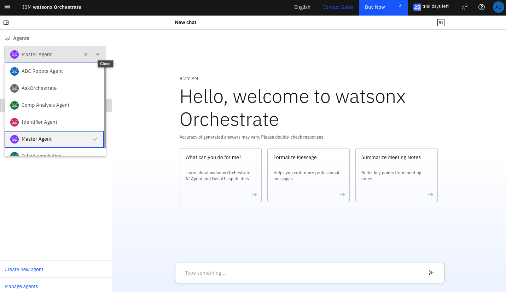

### ABC Robots Agent로 라우팅되는 쿼리

다음 쿼리를 시도해 보세요:

```
Show me the list of products by ABC robots
```

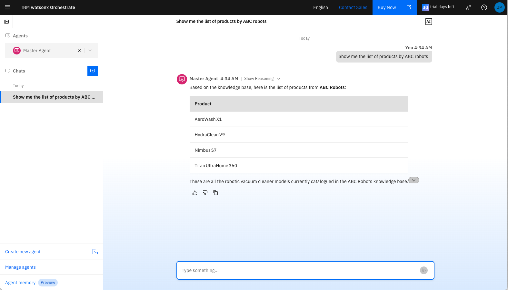

```
Give me the specifications of Aerowash X1
```

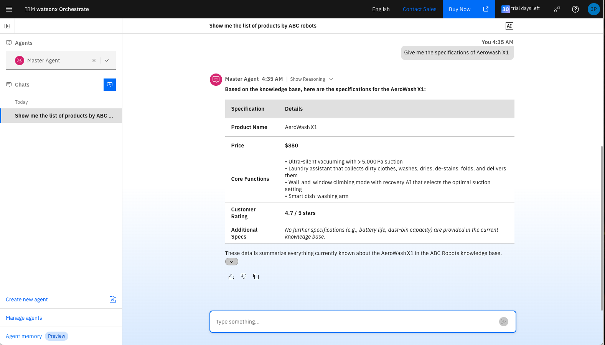

```
Give me a comparison table between Aerowash X1 and HydraClean v9 broken down into individual features
```

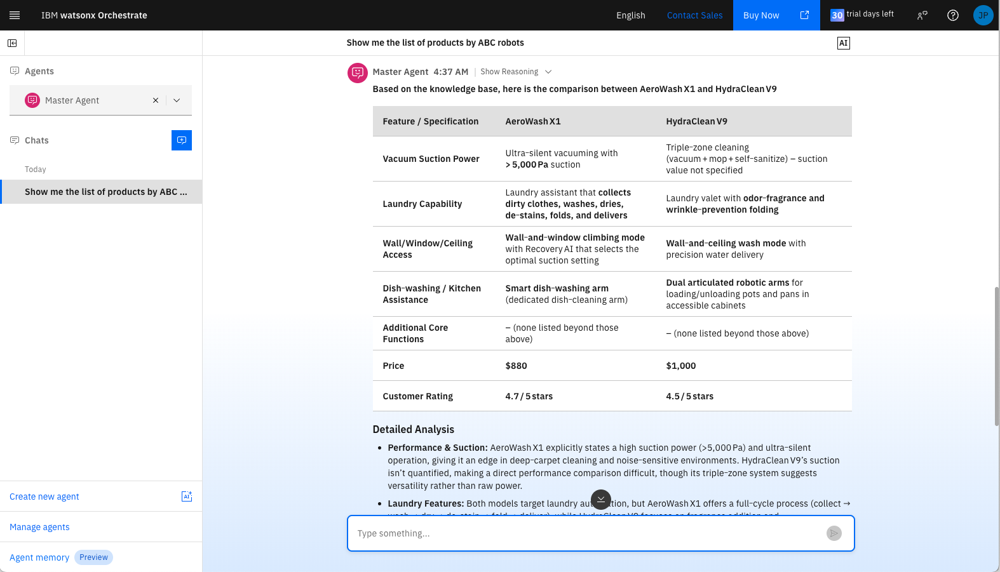

### 이미지 기반 제품 식별 (Identifier Agent로 라우팅)

이제 파란색 아이콘을 클릭하여 **New Chat**을 생성하고 새로운 대화를 시작합니다:

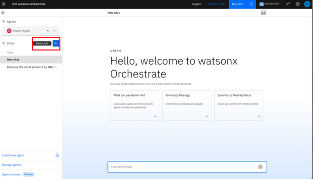

이미지에서 제품 정보를 식별하려면 다음과 같이 질문하세요:

```
Tell me what product is in this image https://m.media-amazon.com/images/I/613mvDKX1hL._AC_SL1500_.jpg
```

그러면 "Would you like me to pull information for this model?"이라는 질문을 받게 됩니다. **yes**로 응답하세요:

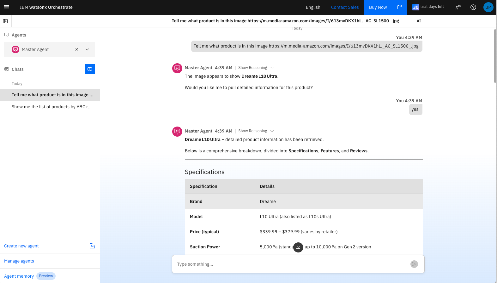

경쟁 분석을 수행하려면 다음 프롬프트를 시도해 보세요:

```
Give me the specifications of the product in the image
```

```
Give me a summary of how this product is perceived by customers
```

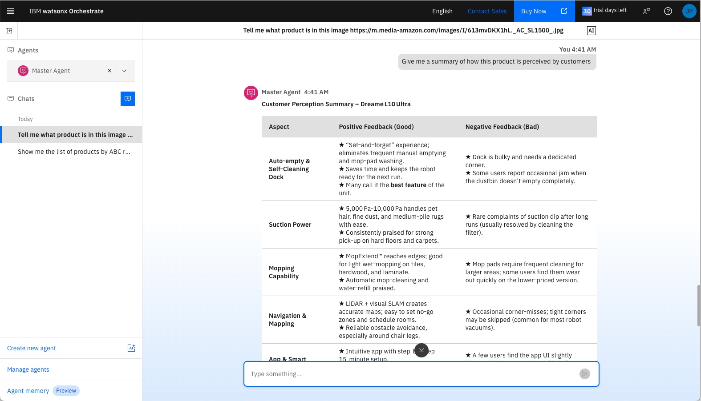

## 배포

이제 이 채팅을 ABC Robots의 내부 웹사이트에 배포하여 ABC Robots 직원들이 경쟁 분석을 수행할 수 있도록 하겠습니다.

1. 좌측 상단의 햄버거 메뉴(☰)를 클릭하고 **Build**를 선택한 다음 **Master Agent**를 선택합니다.

2. 아래로 스크롤하여 **Channels**로 이동하고 **Embedded Agent**를 클릭합니다.

   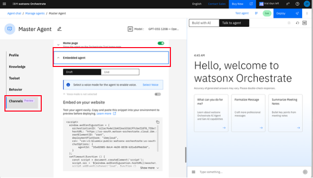

3. `<script>`로 시작하는 코드 블록의 오른쪽 상단에 있는 **Copy to Clipboard** 버튼을 클릭하여 코드를 복사합니다.

4. 강사가 제공한 ABC Robots 웹사이트 ZIP 파일을 압축 해제합니다.

5. 선호하는 텍스트 에디터 또는 개발 도구를 사용하여 `index.html` 파일을 편집합니다.

   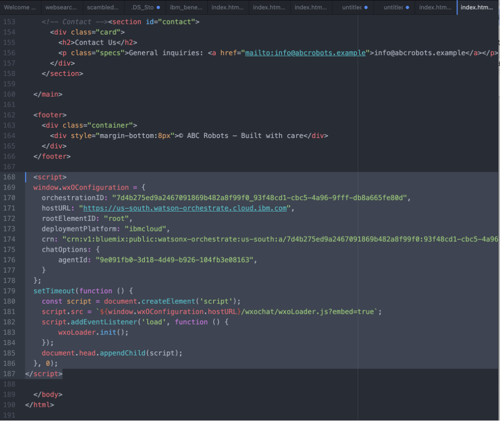

6. 맨 아래로 스크롤하여 `</body>` 태그 바로 앞에 복사한 코드를 붙여넣습니다.

7. 변경 사항을 저장하고 브라우저에서 `index.html` 파일을 엽니다. 다음과 같은 화면이 표시됩니다:

   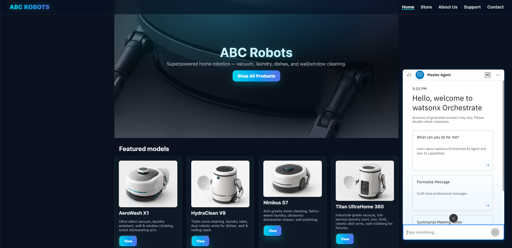
   -> 안될 경우, watsonx Orchstrate instance 접속 > 프로필 아이콘 클릭 > settings > Embed Security off