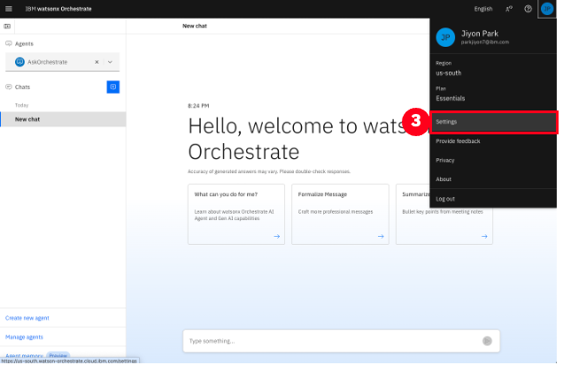

# wxo_bob_handson
wxo x Bob handson asset

## IBM watsonx Orchestrate Agent Development Kit (ADK) 튜토리얼

IBM watsonx Orchestrate는 에이전트를 구축, 테스트 및 관리하기 위한 개발자 중심 도구 세트인 Agent Development Kit (ADK)를 포함하고 있습니다. ADK를 사용하면 개발자는 경량 프레임워크와 간단한 CLI를 사용하여 강력한 에이전트를 설계할 수 있는 자유와 제어권을 얻을 수 있습니다. 명확한 YAML 또는 JSON 파일로 에이전트를 정의하고, 사용자 정의 Python 도구를 생성하며, 몇 가지 명령만으로 전체 에이전트 라이프사이클을 관리할 수 있습니다.

이 튜토리얼에서는 ADK를 설치하고, 로컬 개발 환경을 설정하며, watsonx Orchestrate SaaS 인스턴스에 첫 번째 에이전트를 배포하는 단계별 가이드를 따라갑니다. 이를 통해 유연하고 재사용 가능한 AI 에이전트를 바로 구축할 수 있습니다.

## watsonx Orchestrate Agent Development Kit (ADK) 환경 설정

## Python 설치

ADK를 설치하기 전에 호환되는 Python 버전(3.11~3.13)이 컴퓨터에 설치되어 있는지 확인하세요.

터미널 창을 열고 다음 명령을 실행하여 현재 Python 버전을 확인하세요:

```bash
python --version
```

버전이 3.11-3.13 범위를 벗어나는 경우 호환되는 버전을 설치해야 합니다. [공식 Python 웹사이트](https://www.python.org/downloads/)에서 특정 릴리스를 다운로드하거나, macOS 또는 Linux를 사용하는 경우 `pyenv`와 같은 버전 관리자를 사용하여 여러 Python 버전을 관리하고 필요한 버전을 설치할 수 있습니다.

Python을 설치한 후 Python의 패키지 설치 프로그램인 pip도 설치되어 있는지 확인하세요. 터미널에서 다음 명령을 실행하세요:

```bash
pip --version
```


## Python 가상 환경 생성

ADK를 설치하기 전에 Python 가상 환경을 생성하는 것이 좋습니다. 이렇게 하면 에이전트 종속성을 격리하여 쉽게 관리할 수 있습니다.

프로젝트 폴더에서 다음 명령을 사용하여 가상 환경을 생성하세요:

```bash
python -m venv venv
```

다음으로 가상 환경을 활성화합니다.

**macOS/Linux:**

```bash
source venv/bin/activate
```

**Windows:**

```bash
venv\Scripts\activate
```


## ADK 설치

가상 환경이 활성화된 상태에서 ADK를 설치합니다:

```bash
pip install ibm-watsonx-orchestrate
```

설치 프로세스가 완료되면 다음 명령으로 인스턴스가 제대로 작동하는지 확인하세요:

```bash
orchestrate --help
```


설치가 성공적으로 완료되면 다음과 같은 화면을 볼 수 있습니다:


## ADK를 SaaS 환경에 연결하고 환경 활성화

이제 ADK를 설치했으므로 watsonx Orchestrate SaaS 인스턴스에 연결하여 에이전트를 SaaS 환경에 직접 배포할 수 있습니다.

인스턴스의 API Key와 Instance URL이 필요합니다. 다음 단계를 따르세요:

1. watsonx Orchestrate 인스턴스에 로그인합니다.
2. 오른쪽 상단의 프로필 아이콘을 클릭합니다.
3. 열리는 메뉴에서 **Settings**를 클릭합니다.





4. Settings 페이지에서 **API details** 탭으로 이동합니다.
5. **Service instance URL**을 복사합니다.
6. **Generate API key** 버튼을 클릭합니다.


